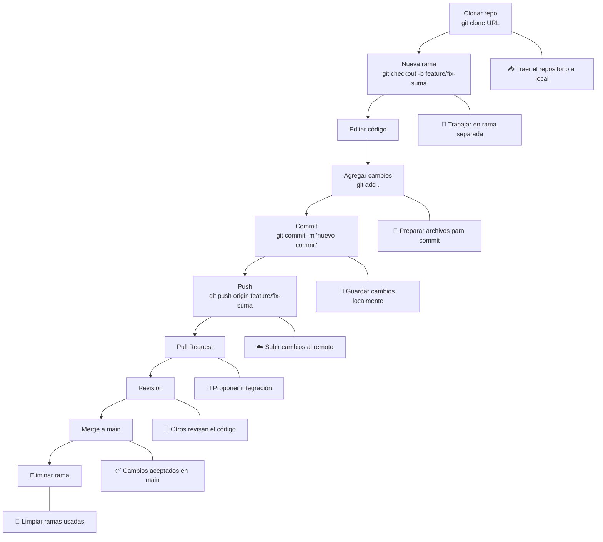

## Flujo de trabajo con Git y GitHub

```mermaid
flowchart TD
    A[Clonar repo<br/>git clone URL]:::step --> 
    B[Nueva rama<br/>git checkout -b feature/fix-suma]:::step --> 
    C[Editar código]:::step --> 
    D[Agregar cambios<br/>git add .]:::step --> 
    E[Commit<br/>git commit -m 'nuevo commit']:::step --> 
    F[Push<br/>git push origin feature/fix-suma]:::step --> 
    G[Pull Request]:::step --> 
    H[Revisión]:::step --> 
    I[Merge a main]:::step --> 
    J[Eliminar rama]:::step

    %% Explicaciones breves
    A --- Atext["📥 Traer el repositorio a local"]
    B --- Btext["🌿 Trabajar en rama separada"]
    D --- Dtext["📂 Preparar archivos para commit"]
    E --- Etext["💾 Guardar cambios localmente"]
    F --- Ftext["☁️ Subir cambios al remoto"]
    G --- Gtext["🔀 Proponer integración"]
    H --- Htext["👥 Otros revisan el código"]
    I --- Itext["✅ Cambios aceptados en main"]
    J --- Jtext["🧹 Limpiar ramas usadas"]

```